# Verilog for Microphones in Matrix Creator
The [MATRIX Creator](https://matrix-io.github.io/matrix-documentation/matrix-creator/overview/) is a fully-featured development board, including sensors, wireless communications, and an FPGA. The purpose of this hobby project is to investigate its FPGA code for receiving signals from 8 [PDM microphones](https://matrix-io.github.io/matrix-documentation/matrix-creator/resources/microphone/).  

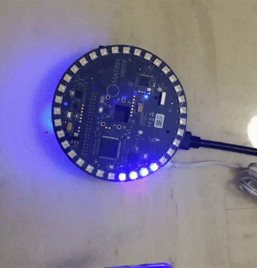
</br>*<An example of applying beam-forming with [ODAS](https://www.hackster.io/matrix-labs/direction-of-arrival-for-matrix-voice-creator-using-odas-b7a15b), which is a library for direction of arrival, tracking in Matrix Creator>*

## Structure of FPGA code for PDM microphones
Matrix creator uses the Wishbone Bus to communicate between RPi and several sensors. The [Wishbone Bus](https://en.wikipedia.org/wiki/Wishbone_(computer_bus)) is an open source hardware computer bus intended to let the parts of an integrated circuit communicate with each other. Among the whole Matrix Creator's Verilog modules, there are two modules, which are relevant to receiving signals from 8 PDM microphones, i.e. ***wb_mic_array.v*** and ***bram.v***. The main part for reading microphone signals is inside ***wb_mic_array.v***. ***bram.v*** provides only the *"decimation ratio"* and *"microphone gain"* to ***wb_mic_array.v***.

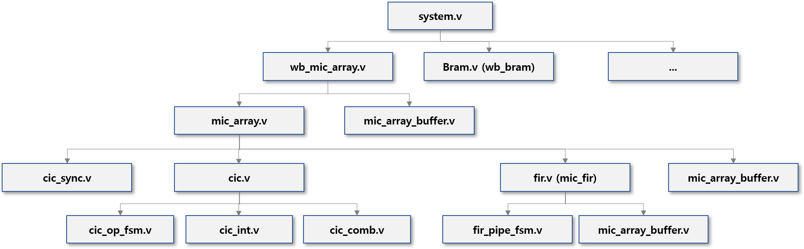
</br><*A structure of FPGA code for PDM microphones*>

## Test bench of FPGA code for PDM microphones

In order to create a test bench for reading and post-processing data **only** from 8 PDM microphones, some parts of the above full FPGA strucutre were selected and modified. Its Hierarchy in ***Xilinx ISE Design Suite*** is shown below:

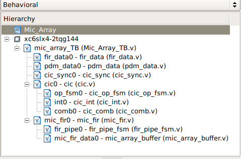
</br><*A structure of Test Bench for PDM microphones*>

### mic_array_TB
*"Mic_Array_TB.v"* is the main module for this test bench. Here, several important frequencies are defined as follows:

- System clock frequency: 150 Mhz
- PDM frequency: 3 Mhz
- Output frequency: 16 Khz
- PDM ratio: 50 (i.e. System clock frequency / PDM frequency)
- Decimation ratio: 187 (i.e. PDM frequency / Output frequency)

The frequency for reading signals from PDM microphone is set by ***PDM_FILE_READ_CLOCK***.
```verilog
// Read time period: 2 was multiplied, since the one clock consists of two values, i.e. "one" and "zero"
parameter [DATA_WIDTH-1:0] PDM_FILE_READ_CLOCK = $floor(PDM_RATIO+1)*2; 

always
#PDM_FILE_READ_CLOCK
begin
  indx_PDM = indx_PDM + 1'd1;
end
```

The ascii file for saving the ouput of test bench is opened/written/closed in this main module. Please be aware that one can start receiving the test bench outputs only after the first number of time steps reaches the size FIR filter coeffcient.
```verilog
integer fd;
fd = $fopen("location of output ascii file", "w");
$fclose(fd); 
```


### fir_data
*"fir_data.v"* is the module for reading the FIR filter coefficient from an external ascii file. In this test bench, 128 FIR filter coefficient should be used, so this external ascii file should have 128 row in a single column. The values should be written in **16 bit fixed-point in binary** and **two's complement for negative numbers**.

```verilog
// define an array for saving the read FIR filter coefficient
reg signed [FIR_TAP_WIDTH-1:0] fir_data [0:FIR_TAP-1]; // FIR_TAP_WIDTH = 16 and FIR_TAP = 128

initial begin
  $readmemb("location of ascii file including FIR filter coefficient", fir_data);
end
```

### pdm_data
*"pdm_data.v"* is the module for reading PDM microphone signals from an external ascii file. This external ascii file should have 8 binary digit in a single row and the maximum number of row should be under 150,000 and this maximum limit can be changed easily in [Mic_Array_TB.v](#mic_array_tb).

```verilog
# Define a 2D array for saving 150_000 x 8 data from an external ascii file
reg [CHANNELS-1:0] in_data [0:NLINEFILE-1];

# Output PDM data from the 2D array "in_data", whenever input "indx" changes
always @ (indx)
  pdm_data = in_data [indx];

initial
  $readmemb("location of ascii file including the input PDM file", in_data);
```

### cic_sync
*"cic_sync.v"* is the module for controlling the following outputs:
- **pdm_clk** is one bit *reg* having a positive edge, when a new PDM signal is available
- **read_enable** (i.e. **pdm_read_enable** in [cic.v](#cic)) is one bit *reg* being *true*, when a new PDM signal is ready to be read
- **integrator_enable** is one bit *reg* being *true*, while 1~8 PDM signals are being read
- **comb_enable** is one bit *reg* being *true*, in every decimation during one period of **pdm_clk**

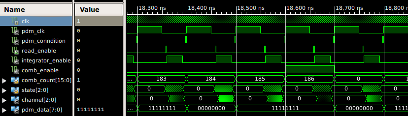
</br><*Waveform in cic_sync.v*>

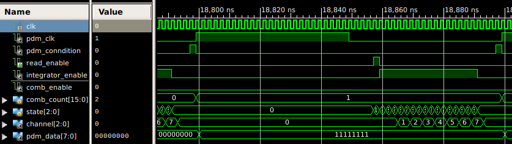
</br><*1st zoomed-in Waveform in cic_sync.v*>


***state[2:0]*** above is defined as follows and it changes over time. The main purpose of having those ***state*** is to control ***integrator_enable*** and ***read_enable*** better:

```verilog
localparam [2:0] S_IDLE = 3'd0;
localparam [2:0] S_READING_TIME	= 3'd1;
localparam [2:0] S_COMPUTE = 3'd2;
localparam [2:0] S_HOLD = 3'd3;

always @(state) begin
  case(state)
  S_IDLE :
  {integrator_enable,read_enable} = {1'b0,1'b0};

  S_READING_TIME :
  {integrator_enable,read_enable}= {1'b0,1'b1};

  S_COMPUTE :
  {integrator_enable,read_enable} = {1'b1,1'b0};

  S_HOLD :
  {integrator_enable,read_enable} = {1'b1,1'b0};

  default :
  {integrator_enable,read_enable} = {1'b0,1'b0};
  endcase
end
```

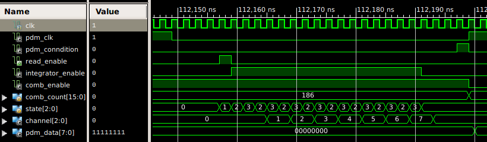
</br><*2nd zoomed-in Waveform in cic_sync.v*>


### cic
*"cic.v"* is the module for performing [CIC filter](https://en.wikipedia.org/wiki/Cascaded_integrator%E2%80%93comb_filter). Its main four functions can be summarized as follows:

1. Update PDM signal based on the ***"pdm_read_enable"***
2. Convert the read binary ("0", "1") into ("-1", "1" in signed 23 bits, two's complement), respectively
3. Perform ***3 times*** of [integrator](#cic_int) in cascade, according to the activated ***"read_en"*** and ***"wr_en"*** in [cic_op_fsm.v](#cic_op_fsm). The 3 cascade of integrators was calculated by using ***generate-for loop***.
```verilog
genvar i;
generate
for (i=0; i<STAGES; i=i+1)
  begin: int_stage
    cic_int #(
      .WIDTH   	(WIDTH),        // 23
      .CHANNELS	(CHANNELS)      // 8
      ) int0 (
      .clk     	(clk),          // input
      .resetn  	(resetn),       // input
      .wr_en   	(wr_en),        // input
      .read_en 	(read_en),      // input
      .channel 	(channel),      // input [2:0]
      .data_in 	(data_int[i]),  // input signed [22:0]
      .data_out	(data_int[i+1])	// output reg signed [22:0]
    );
  end
endgenerate
```
4. Perform ***3 times*** of [comb filter](#cic_comb) in cascade, according to the activated ***"read_en & comb_enable"*** and ***"write_memory***, i.e. ***wr_en & comb_enable"*** in [cic_op_fsm.v](#cic_op_fsm). The 3 cascade of comb-filters was calculated by using ***generate-for loop***.
```verilog
genvar j;
generate
for (j=0; j<STAGES; j=j+1)
  begin: comb_stage
    cic_comb #(
    .WIDTH    (WIDTH),                  // 23
    .CHANNELS (CHANNELS)                // 8
    ) comb0 (
    .clk      (clk),                    // input
    .resetn   (resetn),                 // input
    .read_en  (read_en & comb_enable),  // input, because "comb filter should be executed for each "Decimation ratio"
    .wr_en    (write_memory),           // input
    .channel  (channel),                // input [2:0]
    .data_in  (data_comb[j]),           // input signed [22:0]
    .data_out (data_comb[j+1])          // output reg signed [22:0]
    );
  end
endgenerate
```

#### cic_op_fsm
*"cic_op_fsm.v"* is the instantiated module under [cic.v](#cic), for controling the reading PDM microphone signals in each channel. ***state[2:0]*** in this module is defined as in the following Verilog codes and its change over time can be displayed in the following Waveform:
```verilog
localparam [2:0] S_IDLE  = 3'd0;
localparam [2:0] S_READ  = 3'd1;
localparam [2:0] S_STORE = 3'd2;
```
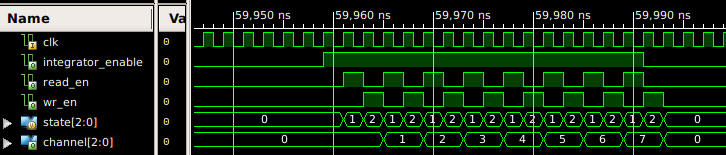
</br><*Waveform in cic_op_fsm.v*>


#### cic_int
*"cic_int.v"* is the instantiated module under [cic.v](#cic) and it acts as an integrator. Its working principle is described in the diagram and in the attached Verilog code snippet. This module should be activated for each ***"read_en"*** and ***"wr_en"*** in [cic_op_fsm.v](#cic_op_fsm).

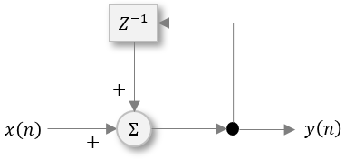

```verilog
assign sum = data_out + data_in;

always @(posedge clk or posedge resetn) begin
  if (resetn)
    data_out <= 0;
  else begin
    case({read_en,wr_en})
      2'b10 : 
        begin
          data_out <= accumulator[channel];
        end

      2'b01 : 
        begin
          accumulator[channel] <= sum;
          data_out <= data_out; 
        end

      default :
        data_out <= data_out;
    endcase
  end
end
```


#### cic_comb
*"cic_comb.v"* is the instantiated module under [cic.v](#cic) and it acts as a comb filter. Its working principle is described in the diagram and in the attached Verilog code snippet. This module should be activated for each ***"read_en & comb_enable"*** and ***"wr_en & comb_enable"*** in [cic_op_fsm.v](#cic_op_fsm).


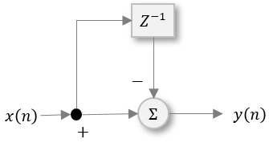

```verilog
assign diff = data_in - prev;

always @(posedge clk or posedge resetn) begin
  if (resetn) begin
    data_out <= 0;
    prev     <= 0;
  end
  else begin
    case({read_en,wr_en})
    2'b10 :
      begin
        data_out <= data_out_prev[channel];
        prev     <= data_in_prev[channel];
      end
    2'b01 :
      begin
        data_in_prev[channel]  <= data_in;
        data_out_prev[channel] <= diff;
      end
    default :
      data_out <= data_out;
    endcase
  end
end
```

### mic_fir
*"mic_fir.v"* is the module for performing FIR filter to the ouput of [CIC filter](#cic). This test bench uses the total 128 FIR filter coefficients, which were imported from the routine [fir_data.v](#fir_data).

#### fir_pipe_fsm
*"fir_pipe_fsm.v"* is the instantiated module under [mic_fir.v](#mic_fir), for controling the counters in the FIR filter. 

##### fir_pipe_fsm / Input
- ***end_write_data***, which becomes true, when receving the last channel data from comb-filter.
```verilog
//  "end_write_data" becomes true, only with the last channel & true "data_load"
assign end_write_data = (&channel) & data_load;
```

##### fir_pipe_fsm / Outputs
- ***tap_count (coeff_addr)***: 7 bit counter, which can count max. up to 128 [0, 127]. It is the output of [mic_fir.v](#mic_fir), which call the FIR coefficient array, whos index is equal to this counter.
- ***channel_count***: 3 bit counter for counting the number of channel. It is important to understand that it increases by one when ***tap_count*** finishes one loop (128).
- ***load_data_memory***: it gets "true", during ***tap_count*** increases.
- ***reset_tap***: it gets "true", during ***tap_count***  starts.
- ***write_data***: it gets "true", during ***channel_count*** increases

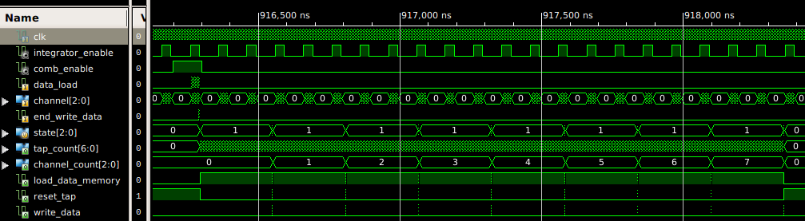
</br><*Waveform in fir_pipe_fsm*>

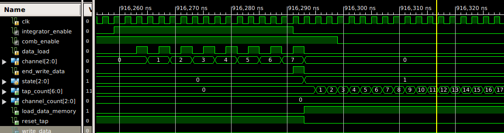
</br><*A begin of Waveform in fir_pipe_fsm*>

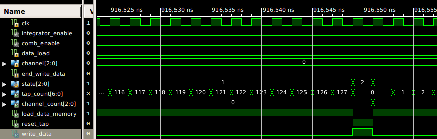
</br><*A channel transition in Waveform in fir_pipe_fsm*>

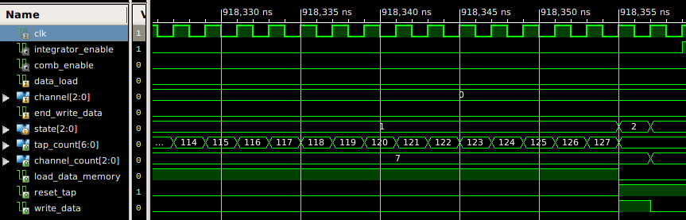
</br><*An end of Waveform in fir_pipe_fsm*>

state[2:0] above is defined as follows and it changes over time. The main purpose of having those state is to control ***count_en (=write_data)***, ***reset_tap***,***reset_channel***,***load_data_memory***:

```verilog
localparam [1:0] S_IDLE = 3'd0;
localparam [1:0] S_PIPE = 3'd1;
localparam [1:0] S_NEXT = 3'd2;
```

```verilog
always @(posedge clk or posedge resetn) begin
  if(resetn)
    state <= S_IDLE;
  else begin
    case(state)
    S_IDLE : begin
      if(end_write_data)
        state <= S_PIPE;
      else
        state <= S_IDLE;
      end
    S_PIPE :
      if(tap_count == FIR_TAP-1) // PipeLine stages
        state <= S_NEXT;
      else
        state <= S_PIPE;
    S_NEXT :
      if(channel_count == CHANNELS-1)
        state <= S_IDLE;
      else
        state <= S_PIPE;
    default :
      state <= S_IDLE;
    endcase 
  end // if else
end // always
```

#### mic_fir
"wr_data_addr" increases, as "write_memory" is from the output of CIC filter
"wr_data_addr" =  (7 bits for 128 FIR filter elements) + (3 bits for channels)

// Pipe line stage 1

always @(posedge clk or posedge  resetn) begin
if(resetn) begin
reset_tap_p1  <= 0;
write_data_p1 <= 0;
end else begin
reset_tap_p1  <= reset_tap;
write_data_p1 <= write_data;
end
end

// "factor_wire" is [16+16-1:0], because it should have max. 16 bit x 16 bit
assign factor_wire = data_reg_a * data_reg_b;

// Pipe line stage 2
write_data_p2	<= write_data_p1;
data_reg_c	<= { factor_wire[(FIR_TAP_WIDTH+DATA_WIDTH)-1], 										// [(16+16)-1]
factor_wire[(FIR_TAP_WIDTH+DATA_WIDTH)-3:FIR_TAP_WIDTH-1] };		// [(16+16)-3 : 16-1]
// Question: why factor_wire[30] should be removed?
// Answer: 16 bit x 16 bit gives always "zero" at "MSB - 1" bit, so this bit is removed to improve the accuracy
reset_tap_p2  <= reset_tap_p1;

// Pipe line stage 3
always @(posedge clk or posedge  resetn) begin
if(resetn | reset_tap_p2) begin
data_reg_d <= 0;
end else begin
// Question: Why "data_reg_d" and "data_reg_c" should be added?
// Answer: this is the summation of FIR filter, i.e. convolution
data_reg_d <= (data_reg_d + data_reg_c);
end
end

assign data_out				= data_reg_d;
assign write_data_mem	= write_data_p2;

#### mic_array_buffer
*"mic_array_buffer.v"* is the instantiated module under [mic_fir.v](#mic_fir). This buffer is for saving and reading the input microphone signal from comb-filter to FIR filter. It is important to understand a sturucture of this module, since *"mic_array_buffer.v"* is ofent used as data buffer at several locations of matrix creator's FPGA codes.


## Validation example
One sine wave containing the four ....TBD
