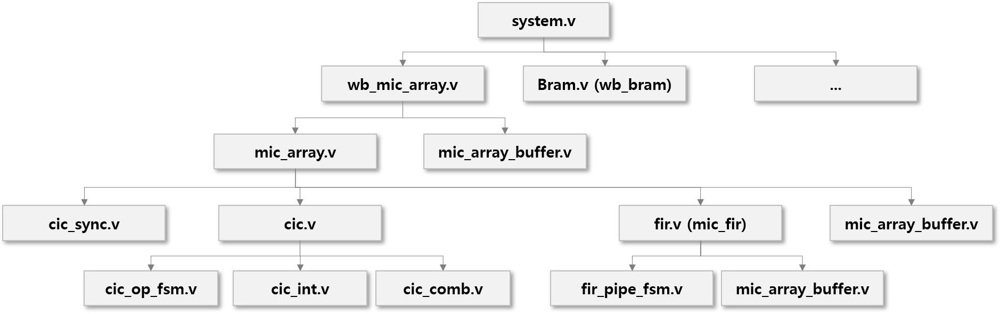

# Verilog for Microphones in Matrix Creator
The [MATRIX Creator](https://matrix-io.github.io/matrix-documentation/matrix-creator/overview/) is a fully-featured development board, including sensors, wireless communications, and an FPGA. The purpose of this hobby project is to investigate its FPGA code for 8 [PDM microphones](https://matrix-io.github.io/matrix-documentation/matrix-creator/resources/microphone/).

[ODAS](https://www.hackster.io/matrix-labs/direction-of-arrival-for-matrix-voice-creator-using-odas-b7a15b) is a library for direction of arrival, tracking in Matrix Creator 

## Structure of FPGA code for PDM microphones

- Filter information
  - 128 FIR TAB
  - 3 stages CIC
  - General information
- Sys. Freq: 150 Mhz
  - Out Freq: 16 kHz
  - PDM Freq: 3 Mhz
  - PDM ratio: 49
  - PDM Reading Time: 28
  - Decimation ratio (sample rate): 186 (i.e. PDM Freq / Out Freq)

## Open points
- TBD

