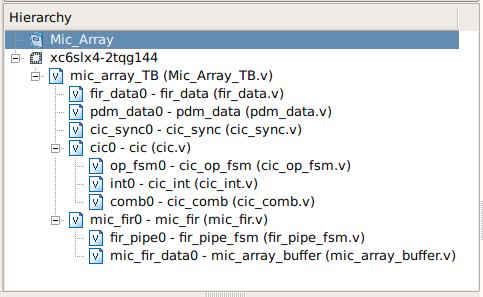

# Verilog for Microphones in Matrix Creator
The [MATRIX Creator](https://matrix-io.github.io/matrix-documentation/matrix-creator/overview/) is a fully-featured development board, including sensors, wireless communications, and an FPGA. The purpose of this hobby project is to investigate its FPGA code for 8 [PDM microphones](https://matrix-io.github.io/matrix-documentation/matrix-creator/resources/microphone/).  


</br>*<An example of applying beam-forming with [ODAS](https://www.hackster.io/matrix-labs/direction-of-arrival-for-matrix-voice-creator-using-odas-b7a15b), which is a library for direction of arrival, tracking in Matrix Creator>*

## Structure of FPGA code for PDM microphones
Matrix creator uses the Wishbone Bus to communicate between RPi and several sensors. The [Wishbone Bus](https://en.wikipedia.org/wiki/Wishbone_(computer_bus)) is an open source hardware computer bus intended to let the parts of an integrated circuit communicate with each other. Among the whole Matrix Creator's Verilog modules, there are two modules, which are relevant to receiving the signals from 8 PDM microphones, i.e. ***wb_mic_array.v*** and ***bram.v***. The main part for reading microphone signals is ***wb_mic_array.v*** and ***bram.v*** is only providing the *"decimation ratio"* and *"microphone gain"* to ***wb_mic_array.v***.


</br><*A structure of FPGA code for PDM microphones*>

## Test bench of FPGA code for PDM microphones

In order create a test bench for reading and post-processing data **only** from 8 PDM microphones, some parts of the above full FPGA strucutre were selected and modified. Its Hierarchy in *Xilinx ISE Deisng Suite* is shown below:


</br><*A structure of Test Bench for PDM microphones*>

### Mic_Array_TB.v
*Mic_Array_TB.v" is the main module for this test bench. Here, several important frequencies are defined as follows:

- System clock frequency: 150 Mhz
- PDM frequency: 3 Mhz
- Output frequency: 16 Khz
- PDM ratio: 50 (i.e. System clock frequency / PDM frequency)
- Decimation ratio: 187 (i.e. PDM frequency / Output frequency)

The frequency for reading signals from PDM microphone is set by *PDM_FILE_READ_CLOCK*.
```verilog
// Read time period: 2 was multiplied, since the one clock consists of two values, i.e. "one" and "zero"
parameter [DATA_WIDTH-1:0] PDM_FILE_READ_CLOCK = $floor(PDM_RATIO+1)*2; 

always
#PDM_FILE_READ_CLOCK
begin
  indx_PDM = indx_PDM + 1'd1;
end
```

The ascii file for saving the ouput of test bench is opened/written/closed in this main module. Please be ware that one can start receiving the test bench outputs only after the first number of time steps reaches the size FIR filter coeffcient.
```verilog
integer fd;
fd = $fopen("location of output ascii file", "w");
$fclose(fd); 
```


### fir_data.v
*fir_data.v* is the module for reading the FIR filter coefficient from an external ascii file. In this test bench, 128 FIR filter coefficient should be used, so this external ascii file should have 128 row in a single column. The values should be written in **16 bit fixed-point in binary** and **two's complement for negative numbers**.

```verilog
// define an array for saving the read FIR filter coefficient
reg signed [FIR_TAP_WIDTH-1:0] fir_data [0:FIR_TAP-1]; // FIR_TAP_WIDTH = 16 and FIR_TAP = 128

initial begin
  $readmemb("location of ascii file including FIR filter coefficient", fir_data);
end
```

### pdm_data.v
*pdm_data.v* is the module for reading PDM microphone signals from an external ascii file.

```verilog

```

### cic_sync.v
*cic_sync.v* is the module for **.

### cic.v
*cic.v* is the module for **.

#### cic_op_fsm.v
*cic_op_fsm.v* is the module for **.

#### cic_int.v
*cic_int.v* is the module for **.


```verilog
assign sum = data_out + data_in;

always @(posedge clk or posedge resetn) begin
  if (resetn)
    data_out <= 0;
  else begin
  case({read_en,wr_en})
    2'b10 : begin
      data_out <= accumulator[channel];
      end

    2'b01 : begin
      accumulator[channel] <= sum;
      data_out <= data_out; 
      end

    default :
      data_out <= data_out;
    endcase
  end
end
```


#### cic_comb.v
*cic_comb.v* is the module for **.


```verilog
assign diff = data_in - prev;

always @(posedge clk or posedge resetn) begin
    if (resetn) begin
    data_out <= 0;
    prev     <= 0;
  end
  else begin
    case({read_en,wr_en})
    2'b10 :
      begin
      data_out <= data_out_prev[channel];
      prev     <= data_in_prev[channel];
      end
    2'b01 :
      begin
      data_in_prev[channel]  <= data_in;
      data_out_prev[channel] <= diff;
      end
    default :
      data_out <= data_out;
    endcase
  end
end
```


### fir.v
*fir.v* is the module for **.

- Filter information
  - 128 FIR TAB
  - 3 stages CIC
  - General information

#### fir_pipe_fsm.v
*fir_pipe_fsm.v* is the module for **.

#### mic_array_buffer.v
*mic_array_buffer.v* is the module for **.


## Open points
- TBD

